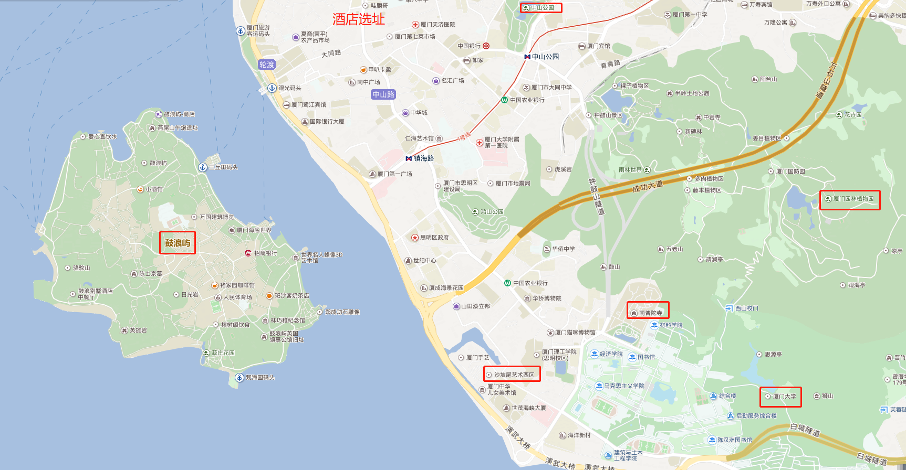

# 主要景点
## 鼓浪屿

## 厦门大学

## 南普陀寺

## 厦门园林植物园

## 沙波尾

## 中山公园

## 台湾民俗村(待定)
距离较远，要做公交车

# 酒店
[如家快捷酒店(厦门中山路步行街店)](http://hotels.ctrip.com/hotel/1583166.html?isFull=F#ctm_ref=hod_sr_lst_dl_n_1_8) 大床 近中山公园 193

# 景点分布

# 旅行线路
* 6月17日晚上
飞机： 广州 -> 厦门 
地铁： 厦门机场-> 酒店

* 6月18日
鼓浪屿

* 6月19日
上午：中山公园
下午：厦大+南普陀寺+沙坡尾

* 6月20日
植物园

晚上：飞机回广州

